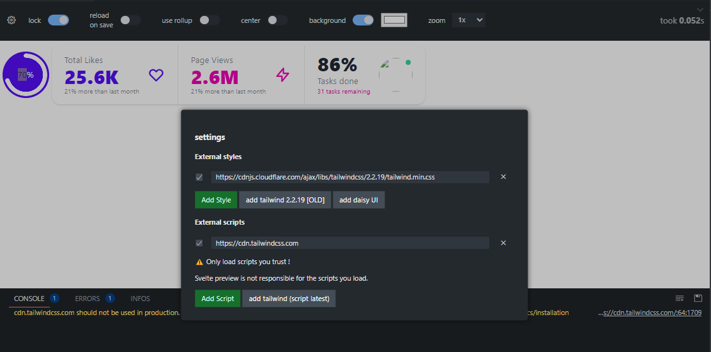
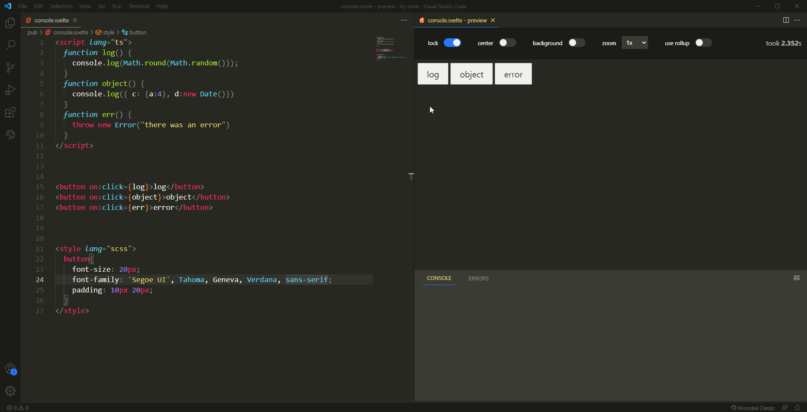
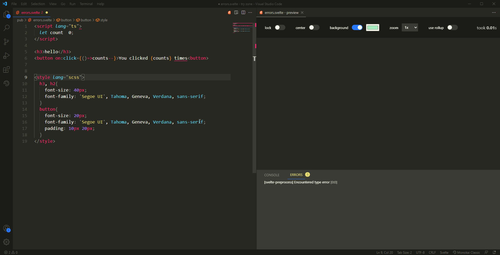
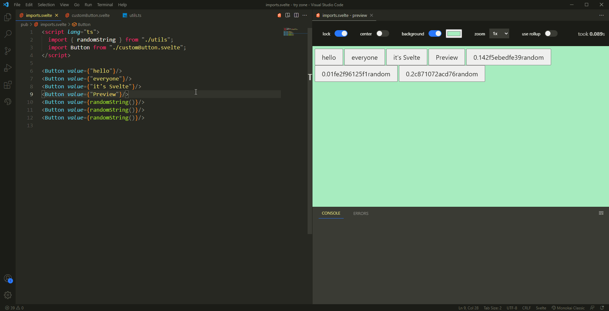
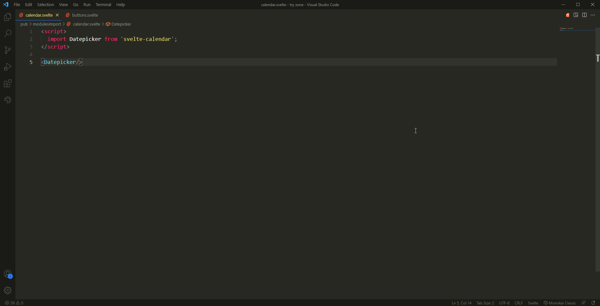
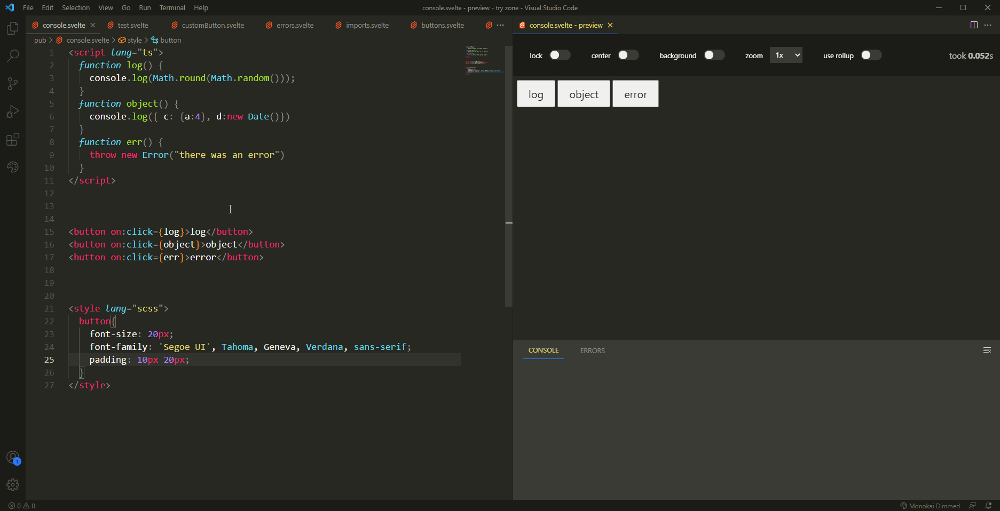
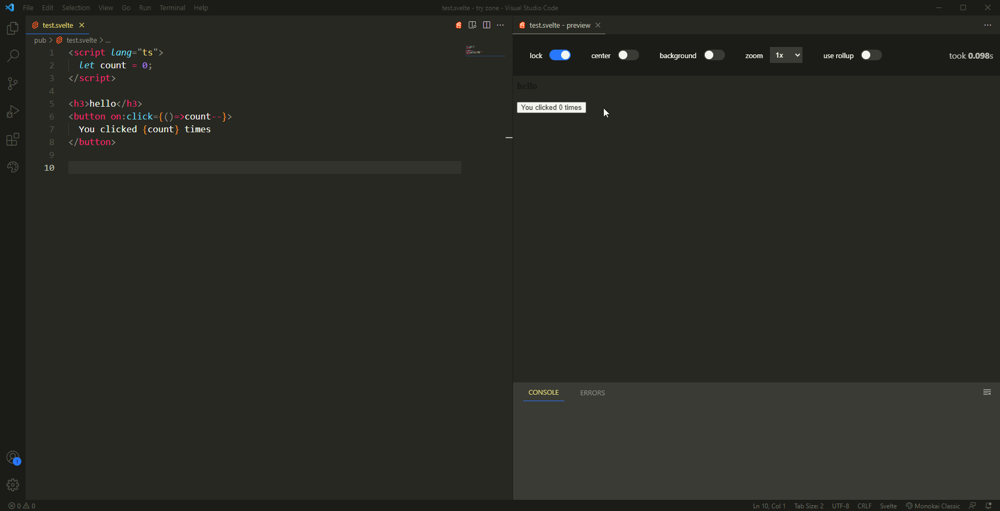
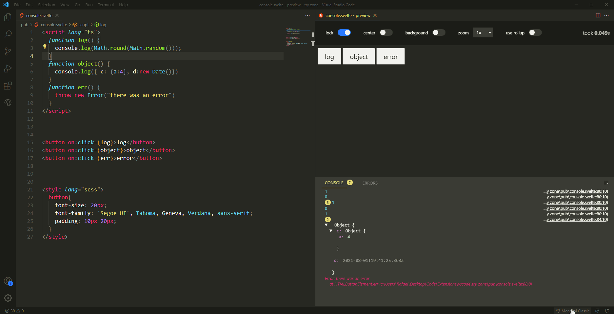

# svelte-preview

Svelte-preview is a vscode extension to preview your svelte components live 

> :warning: **The extension does not yet support the latest svelte versions (runes).**

## Features

### Loading of external styles and scripts

### Live preview of svelte files

### Console

### Errors display

### Support imports

### Preview focused file

### Preview controls

### Theme aware

### compatible with preprocessors

- scss
- typescript
- babel
- coffeescript
- less
- sass
- stylus

## Use rollup

This switch allows you to use rollup to compile your svelte files it is generaly slower and require you to save your files to update.

- custom dependencies parser:
  - may not always work
  - usually faster
  - no need to save files
  - errors and logs show true file paths
- Rollup:
  - may not always work
  - usually slower
  - need to save files
  - errors and logs show fake (blob) path

## Extension Settings

None

> If you think I should add some settings, create an issue in [github](https://github.com/rafalou38/svelte-preview/issues)

## Known Issues

Some node modules raise this when using custom dependencies parser:

    Error: Function called outside component initialization

## Release Notes

See changelog to see all the versions

## [2.7.2]

+ Change code parser to support ts imports
+ Tweak resolver to support more cases
+ Fix static script and styles in preview (fixed tailwind)
+ Add warning for unsupported svelte versions

## latest [2.7.3]

+ Fix Row/lines error
+ fix issue of previous release