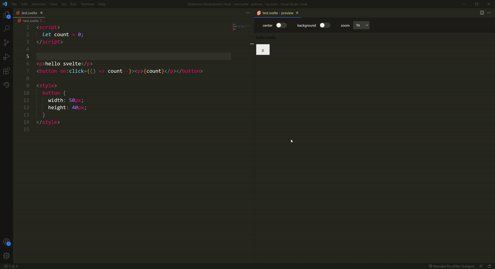

# svelte-preview

Svelte-preview is a vscode extension to preview your svelte components live

## Features

### Live preview of svelte files

### Preview controls

### persistent controls

### Errors display

### Theme aware

## Extension Settings

None

> If you think I should add some settings, create an issue in [github](https://github.com/rafalou38/svelte-preview/issues)

## Known Issues

- Imports not working
  - node modules
  - local files

## Release Notes

### 1.0.0

Initial release
